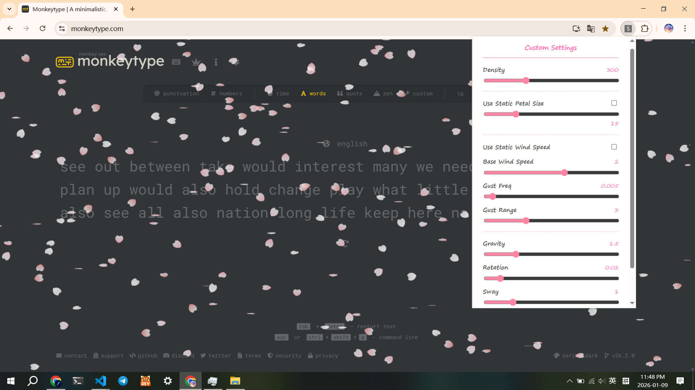

# Sakura Rain Extension 🌸

A lightweight, high-performance Chrome Extension that brings a calming cherry blossom (Sakura) rain effect to any webpage.



> **New in v2.0:** Rebuilt with **React** & **Vite** for the UI, and upgraded to a **Noise-based Physics Engine** for organic movement.

## Key Features

### 1. Advanced Aerodynamics & Noise Simulation (New!)
Unlike typical particle effects that use repetitive Sine waves, this extension simulates the chaotic nature of real wind.
* **Value Noise Algorithm:** Replaced standard trigonometric oscillation with a custom **1D Value Noise** implementation. This ensures wind direction changes are smooth, non-periodic, and unpredictable—just like nature.
* **Gust Curve Physics:** Implements an exponential power curve (Gust Power ~ 1.6) to process noise data. This mimics real-world fluid dynamics where long periods of gentle breeze are punctuated by sudden, stronger gusts.
* **Procedural Geometry:** Petals are rendered in real-time using **Cubic Bezier Curves** and **Quadratic Curves** to form organic shapes with the signature "notch" at the tip.

### 2. Modern React UI (New!)
The control panel has been completely refactored from vanilla HTML/JS to a modern component-based architecture.
* **React 18 + Vite:** High-performance, reactive UI updates.
* **Hot Module Replacement (HMR):** Streamlined development workflow.
* **Component-Driven:** Modular `ControlItem` components for scalable settings management.

### 3. Fully Customizable
Control every aspect of the simulation through the new React popup panel:
* **Density & Size:** Adjust particle count and toggle between static or random size variations.
* **Wind Dynamics:** Control Base Speed, Gust Frequency, and Gust Range.
* **Physics Modifiers:** Fine-tune Gravity, Rotation Speed, and 3D Sway amplitude.
* **Visuals:** Adjust global opacity to ensure text readability on any website.

## Tech Stack

* **Frontend UI:** React 18, Vite
* **Core Logic:** Vanilla JavaScript (ES6+)
* **Rendering:** HTML5 Canvas API (High-performance batch rendering)
* **Math:** Custom Value Noise & Bezier Curves

## Installation (Developer Mode)
You can download v1.0 on Chrome Web Store (and pls give me a 5-star rating if you enjoy it!!):
```bash
https://chromewebstore.google.com/detail/sakura-rain-effect/eejeknfgpnmginlijbggmkgcmlenddje
```
OR:
To run this extension locally:

1.  **Clone the repository**
    ```bash
    git clone [https://github.com/j494zhu/sakura-rain-extension.git](https://github.com/j494zhu/sakura-rain-extension.git)
    cd sakura-rain-extension
    ```

2.  **Build the UI**
    The popup UI needs to be compiled before use.
    ```bash
    cd react-popup
    npm install
    npm run build
    ```
    *(This will generate the `react-popup/dist` folder required by Chrome)*

3.  **Load into Chrome**
    * Navigate to `chrome://extensions/` in your browser.
    * Enable **Developer mode** in the top right corner.
    * Click **Load unpacked**.
    * Select the **root directory** of this project (`sakura-rain-extension`).

4.  **Enjoy**
    * Open any webpage to see the cherry blossoms fall!

## Configuration

Click the extension icon to open the React control panel.

| Setting | Description |
| :--- | :--- |
| **Density** | Controls the total number of active petals (Performance optimized). |
| **Wind Mode** | Disable "Static Wind Speed" to activate the **Noise-based Gust System**. |
| **Gust Freq/Range** | Controls how fast the noise map is traversed and the amplitude of wind variation. |
| **Gravity** | Adjusts the vertical falling velocity. |
| **Rotation** | Controls the angular velocity (2D spin). |
| **Sway** | Controls the 3D flipping amplitude (simulated via scale matrices). |

> **Note:** The animation is best viewed on dark-themed websites.

## Project Structure

```text
.
├── manifest.json           # Chrome Extension Manifest (v3)
├── js/
│   ├── main.js             # Content Script Entry Point
│   ├── SakuraManager.js    # Physics Loop & Noise Logic
│   ├── SakuraPetal.js      # Petal Class & Canvas Rendering
│   ├── noise.js            # Value Noise Algorithm
│   └── Config.js           # State Management
├── react-popup/            # New React UI Source
│   ├── src/                # React Components
│   ├── dist/               # Compiled UI (Loaded by Chrome)
│   └── vite.config.js      # Build Configuration
└── assets/                 # Icons and Demos