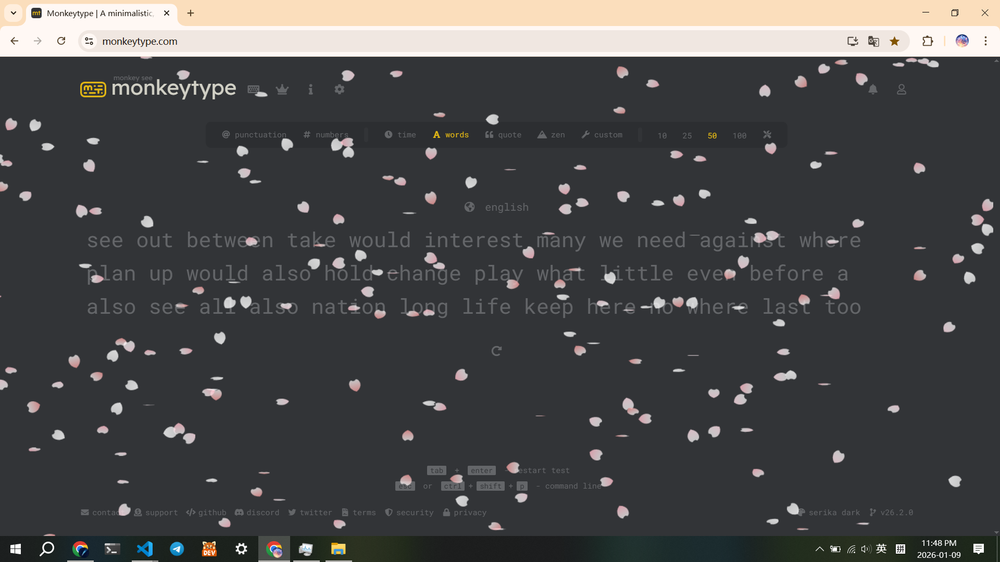

# Sakura Rain Extension

A lightweight, high-performance Chrome Extension that brings a calming cherry blossom (Sakura) rain effect to any webpage.



Built with Vanilla JavaScript and HTML5 Canvas, featuring custom physics simulation and a highly customizable configuration panel.

## Key Features

### 1. Procedural Geometry & Physics Simulation
Instead of using static images, every petal is mathematically rendered in real-time.
* **Mathematical Modeling**: Petals are drawn using a combination of **Cubic Bezier Curves** (`bezierCurveTo`) for the organic body shape and **Quadratic Curves** (`quadraticCurveTo`) to precisely render the signature **notch** at the petal's tip.
* **Physics Engine**: Implements a custom physics model handling gravity, aerodynamic drag, and wind force vectors.
* **Dynamic Motion**: Features a unique sway mechanism where petals rotate and flip in 3D space (simulated via 2D transformation matrices) as they fall.

*(See Configurations for more detailed spec)*

### 2. Fully Customizable
Control every aspect of the simulation through the popup panel:
* **Density**: Adjust the total number of active particles on the screen.
* **Petal Size**: Toggle between a fixed size or allow random size variations.
* **Wind Speed**: Control the horizontal wind force and direction.
* **Gravity**: Adjust the vertical falling speed of the petals.
* **Rotation**: Control the angular velocity (self-spin speed) of the petals.
* **Sway**: Fine-tune the amplitude of the horizontal left-right oscillation.
* **Opacity**: Adjust the global transparency level of the petals to prevent text obstruction.

### 3. High Performance
* **Canvas Rendering**: Utilizes the HTML5 `<canvas>` API for efficient batch rendering of hundreds of particles without DOM layout thrashing.
* **Zero Dependencies**: Written in vanilla JavaScript to ensure maximum speed and minimal footprint.

## Installation (Developer Mode)

Since this extension is currently in development (or pending Store approval), you can install it manually:

1.  **Clone the repository**
    ```bash
    git clone [https://github.com/your-username/your-repo-name.git](https://github.com/your-username/your-repo-name.git)
    ```

2.  **Open Chrome Extensions**
    * Navigate to `chrome://extensions/` in your browser.
    * Enable **Developer mode** in the top right corner.

3.  **Load Unpacked**
    * Click the **Load unpacked** button.
    * Select the directory where you cloned this repository.

4.  **Enjoy**
    * The extension is now active. Open any webpage to see the effect!

## Configuration

Click the extension icon in the browser toolbar to open the control panel.

| Setting | Description |
| :--- | :--- |
| **Density** | Controls the total density of petals on the screen. |
| **Petal Size** | Enable "Static Petal Size" for fixed dimensions, or disable for random variations. |
| **Wind Mode** | Enable "Static Wind Speed" to lock at Base Speed. Disable to activate dynamic gusts. |
| **Gust Settings** | Adjust "Frequency" (keep low) and "Range" to simulate natural wind changes. |
| **Gravity** | Adjusts the vertical falling speed of the petals. |
| **Rotation** | Controls the 2D spinning velocity of the petals. |
| **Sway** | Controls the 3D swaying/flipping amplitude. |
| **Opacity** | Adjusts the global transparency level of the petals. |

> **Note:** To reset the simulation to its default settings, simply refresh the current webpage.
> **Note:** The animation views better under dark backgrounds. 

## Project Structure

```text
.
├── manifest.json       # Extension configuration
├── popup.html          # Settings UI
├── style.css           # UI Styling
├── demo_1.png          # Preview Image
└── js/
    ├── main.js         # Entry point
    ├── SakuraPetal.js  # Petal class & rendering logic
    ├── SakuraManager.js# Manages particle lifecycle
    ├── Config.js       # Shared configuration state
    └── Utils.js        # Helper functions